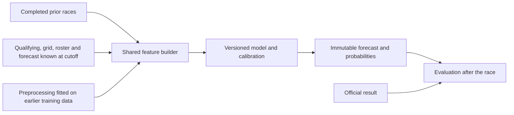

# F1 predictor: diagnosis and implementation plan

Prepared 11 September 2026. Scope: predict the race **after qualifying and before the race**, as confirmed by the user. The main objective is to improve winner and podium predictions while retaining useful full-field ordering.

## 1. Recommended direction

**Fix the data contract, evaluation, and qualifying features first. Keep LightGBM as the first model to improve. Benchmark statistical ranking models and a pretrained tabular transformer; defer a transformer trained from scratch.**

The project already contains a top-10 classifier, a LambdaRank model, and a grid/ranker blend. Adding another architecture without correcting the pipeline would compare models on unrealistic inputs and could reward the wrong behavior. The strongest immediate opportunities are current-weekend qualifying pace, separating driver form from current car strength, and choosing models for winner/podium performance.

The requested deliverable is this plan. No predictive code, datasets, saved models, or blend weights were changed, and no new model was trained during this review.

## 2. What the current project actually does

### Saved data and artifacts

The local files contain 2,080 driver-race rows, 103 races, and 30 model features. They contain recognizable F1 records rather than the `D00`-style identifiers generated by `make_synthetic.py`; independent verification of every source result remains outstanding.

| Season | Driver-race rows | Races | Role under current split code |
| --- | ---: | ---: | --- |
| 2022 | 440 | 22 | Training |
| 2023 | 440 | 22 | Training |
| 2024 | 479 | 24 | Training |
| 2025 | 479 | 24 | Validation |
| 2026 | 242 | 11 | Test |

The last stored race is dated 26 July 2026. The README's 2018-start/synthetic-only description and `predict.py`'s eight-race test description are stale. The current split implies 1,359 training rows across only 68 races. Saved artifacts have no training-data manifest, so their exact fitting history cannot be independently established from the files alone.

### Reproduced results

These are diagnostic results from the existing artifacts on the 11 stored 2026 races, using the repository's current label and tie-handling conventions. They are **not a clean estimate of live forecasting quality**, because of the issues below.

| Method used to order drivers | Correct winner | Podium set overlap | Top-10 set overlap | Mean Spearman | Exact-position hit rate |
| --- | ---: | ---: | ---: | ---: | ---: |
| Starting-grid order | 8/11 = 72.7% | 19/33 = 57.6% | 73.6% | 0.6432 | 15.3% |
| Sort by top-10 classifier probability | 3/11 = 27.3% | 16/33 = 48.5% | 75.5% | 0.5672 | 9.9% |
| LambdaRank alone | 6/11 = 54.5% | 19/33 = 57.6% | 69.1% | 0.5005 | 9.1% |
| Saved blend: 60% grid rank, 40% model rank | 8/11 = 72.7% | 19/33 = 57.6% | 75.5% | 0.6289 | 14.9% |

Podium overlap measures which three drivers were selected, without requiring the correct P1/P2/P3 order. Exact-position hit rate here is the mean per-race proportion of drivers whose predicted rank equals the stored finishing position.

The classifier's top-10 binary accuracy is 77.7%, ROC-AUC 0.7908, log loss 0.5440, and Brier score 0.1798. Its saved validation AUC is 0.8455; that is one possible source of an approximately 85% impression, but it is not 85% correct finishing positions. The user's previous result may also concern a different snapshot.

The blend gets exactly the same winner selections as the grid baseline in these races. For example, both pick Russell in Canada and Barcelona and Antonelli in Britain, whereas the stored winners are Antonelli, Hamilton, and Leclerc respectively. These are useful cases for checking why the model fails to change the baseline; they must not become hand-coded driver exceptions.

### Confirmed problems and their consequences

| Priority | Finding | Evidence in this project | Required change |
| --- | --- | --- | --- |
| P0 | Race-weather leakage | `ingest.weather_row()` averages weather across the race session; these fields enter `FEATURE_COLS`. `weather.add_weather_affinity()` also chooses a historical temperature bucket using the target race's realized temperature. | Use only weather known at the prediction cutoff. Remove unavailable race-weather inputs from the first corrected benchmark, including dependent bucket selection. |
| P0 | Test/validation information enters imputation | `build_features.apply_fill_policy()` calculates global outcome/weather means before `train.chronological_split()`. Full-data mean finish is 10.5982 versus 10.4790 on the implied training partition. DNF means also differ. | Fit imputation state on each training partition only; freeze it for subsequent predictions. |
| P0 | Training and serving fills differ | Training first fills position-like features with the driver's prior average, then a global value. `predict.predict()` uses only the saved global values. In the snapshot, 736 missing driver-circuit means have a usable driver-history fallback. | Use one shared transformation at training, replay, and inference. Save the fallback logic and fitted state together. |
| P0 | Qualifying position is treated as final grid | `predict --from-quali` reads Q-session `Position`. This does not incorporate subsequent grid penalties/pit-lane decisions. Omitted manual-grid drivers are silently assigned pit starts, with a hard-coded position of 20 even for larger fields. | Store qualifying order and the grid known at cutoff separately; require explicit pit-start information, use actual field size, and validate roster completeness. |
| P0 | Misleading metric name | `evaluate.ranking_metrics()` calls a prediction a `top1_hit` when the highest-scored driver finishes anywhere in the top 10. | Rename it to `top_pick_finished_top10`; add actual winner metrics everywhere. |
| P0 | Classification flag means only “position present” | `ingest.race_rows()` sets `classified = notna(Position)`. There are 303 rows with both `is_dnf=1` and `classified=1`, including DNS and disqualification statuses. `train_rank`'s description says DNFs receive zero relevance, but most actually retain position-based relevance. | Define result order, official classification, started, and finished separately. Preserve official ordering where available; do not blindly collapse every retirement to last. |
| P0 | Predictions and metrics depend on input row order | `rank(method='first')` breaks ties by row order. Five shuffles of identical test rows moved ranker Spearman to 0.5107–0.5187 from 0.5005. | Share a deterministic tie policy based only on pre-race information; add a row-permutation invariance check. |
| P1 | Blend optimizes the wrong business objective | `blend_rank.py` selects alpha solely by validation Spearman. `evaluate_rank.py` can pass without improving winner accuracy. | Select against explicit winner/podium criteria; keep whole-field metrics as guardrails. |
| P1 | Current qualifying pace is unused | `quali_best_s` and `gap_to_pole_s` are stored, approximately 98.9% populated, but excluded from `FEATURE_COLS`. | Rebuild comparable, normalized qualifying features and use them in the first feature experiment. |
| P1 | Two feature names overstate their meaning | `form_avg_quali_3` averages prior starting grids; `quali_gap_to_teammate` compares those averages rather than current lap times. `constructor_standing_prior` is accumulated race points, not a standings rank, and omits sprint points. | Rename existing fields; add true qualifying gaps and separately sourced standings or clearly defined recent team performance. |
| P1 | Long-term statistics blur changes in car and form | Circuit means and reliability estimates use all history, with little shrinkage beyond counts. Team identity is represented only indirectly. | Add recency, explicit driver/team state, and uncertainty-aware priors. |
| P1 | Saved models cannot prove their prediction cutoff | No manifest binds data, features, fitted state, model, calibration, and blend. Inference does not verify model training date against target date. | Version the whole model bundle and reject incompatible or future-trained artifacts. |
| P1 | Ingestion and evaluation can hide failures | Failed sessions are skipped; evaluation prints failure but does not exit nonzero. The synthetic generator writes to the real raw-data path. | Add coverage manifests, enforce gates, and isolate synthetic fixtures. |

FastF1 distinguishes finishing `Position` from official `ClassifiedPosition`, which can contain status codes. A retirement can still be officially classified; these concepts need independent fields. Source: [FastF1 result definitions](https://raw.githubusercontent.com/theOehrly/Fast-F1/v3.8.3/fastf1/core.py).

The existing leakage audit passed five sampled rows across five seasons, debut checks for 32 drivers, and first-circuit checks for 768 driver/circuit combinations. That supports its historical aggregation checks. It does not test race-weather availability, fitted imputation state, serving parity, or all features, so its “leakage disproven” message is too broad.

## 3. What research supports

These sources support experiment choices, not a promised accuracy improvement on this repository.

| Evidence | Finding and limitation | Decision for this project |
| --- | --- | --- |
| [Henderson & Kirrane: F1 probabilistic forecasting](https://doi.org/10.1214/17-BA1048), published 2018; [author code](https://github.com/d-a-henderson/F1) | Forecasts for 2010–2013 compared Plackett–Luce variants. Reverse/attrition models performed strongly; truncating ordinary PL helped winner/top-three forecasts. Time weighting had mixed effects, rather than improving every model. This was a different era and did not use current qualifying/car covariates. | Benchmark ordinary and truncated PL, with reverse PL as an additional statistical challenger. Tune recency rather than assuming it helps. |
| [Van Kesteren & Bergkamp: driver and constructor effects](https://arxiv.org/html/2203.08489v2), revised 2023 | Separates driver and constructor contributions. The authors explicitly caution that their retrospective model is not directly suitable for forecasting because current-year effects are unavailable in advance. | Use the decomposition idea, but generate driver/car states sequentially from information available at each cutoff. Do not import full-season fitted ratings into historical predictions. |
| [Lindner et al.: dynamic driver/constructor abilities](https://arxiv.org/abs/2608.04629), August 2026 preprint | Combines qualifying times and race rankings with changing latent driver and constructor states. This is recent methodological support, not verified superiority for this pipeline. | A dynamic rating/state-space model is a later statistical experiment. |
| [Grinsztajn et al.: trees versus tabular deep learning](https://proceedings.neurips.cc/paper_files/paper/2022/hash/0378c7692da36807bdec87ab043cdadc-Abstract-Datasets_and_Benchmarks.html), NeurIPS 2022 | Trees were strong on the studied medium-sized tabular datasets. This predates newer pretrained tabular models and does not establish universal tree superiority. | Improve the existing boosted-tree benchmark before paying the complexity cost of a custom neural model. |
| [Gorishniy et al.: FT-Transformer and neural baselines](https://arxiv.org/abs/2106.11959), NeurIPS 2021 | FT-Transformer and a ResNet-style baseline were competitive, with no universally best choice against boosted trees. | If testing neural models trained here, include a small MLP/ResNet baseline under the same splits and budget. |
| [Hollmann et al.: TabPFN](https://www.nature.com/articles/s41586-024-08328-6), Nature 2025 | A pretrained tabular transformer demonstrated strong small-data classification/regression results. Generic tabular benchmarks do not establish performance on grouped, drifting F1 races. | A pretrained TabPFN challenger is more justified than assuming all transformers need to be trained from scratch on this small dataset. |

For implementation, use the [LightGBM 4.6.0 ranking parameters](https://lightgbm.readthedocs.io/en/v4.6.0/Parameters.html), matching the installed model library. `eval_at` controls evaluation cutoffs, while `lambdarank_truncation_level` controls training emphasis; default label gains are exponential. The current ranker already gives substantial weight to high finishing positions. Its weakness cannot be explained simply as “it treats all positions equally.”

Preprocessing must be fitted inside each training split, following [scikit-learn's leakage guidance](https://scikit-learn.org/stable/common_pitfalls.html). Ordinary random cross-validation is unsuitable for this sequence of related races; use chronological event blocks, consistent with [scikit-learn's time-series guidance](https://scikit-learn.org/stable/modules/cross_validation.html).

## 4. Define the forecasting contract before rebuilding

Use a default cutoff of **60 minutes before scheduled lights-out**, configurable and recorded in UTC. Qualifying must already be complete. A forecast made immediately after qualifying is a separate timestamped snapshot; it must not silently inherit later grid or weather information.

Each forecast must store:

- Stable event ID, circuit-layout ID, session format, forecast cutoff, and roster known at that time.
- Actual qualifying order, grid order known at cutoff, penalties known at cutoff, explicit pit starts, and grid status: confirmed, provisional, or unavailable.
- Data source, event time, publication/availability time where obtainable, retrieval time, and data-quality flags.
- Model bundle ID, feature schema version, last training-result availability time, and fallback reason if used.

If a complete valid grid cannot be established, produce a clearly identified qualifying-order fallback or decline the validated forecast. Do not silently replace missing drivers with pit starters. A late change should create a new prediction snapshot.

Target: the published final race result, with an explicit result-version policy. Retain `result_order`, `classified_position_raw`, `officially_classified`, `started`, `finished`, `status_category`, `laps_completed`, and winner/podium/top-10 labels. Define DNS/withdrawn/disqualified handling with source-backed examples. Known withdrawals at cutoff leave the active roster; later withdrawals remain forecast outcomes. Keep classified retirements eligible for their actual official positions.

A future change to historical results may change evaluation labels, but must never rewrite what information was available to earlier forecasts. Predictions and feature snapshots stay immutable.



## 5. Repair data and features in this order

### A. Establish a clean baseline dataset

1. Preserve the current artifacts and record their hashes before changes. Create separate `data/raw`, `data/snapshots`, `data/features`, and `data/synthetic` locations.
2. Reconcile stored event coverage with source schedules. Explain every missing race/session/entrant and all 19-, 20-, or 22-row fields; do not enforce a fixed field size.
3. Verify examples covering a normal race, classified retirement, DNS, DSQ, pit start, penalty, and sprint weekend. Keep the source result and expected normalized fields as fixtures.
4. Re-ingest the missing 2018–2021 history if source coverage permits. Evaluate both 2018+ and recent-era windows. Older data is an experiment, not automatically more useful data.
5. Preserve UTC timestamps and use stable driver IDs for joins, with abbreviations only for display. Separate constructor lineage from season-specific team performance and distinguish circuit layouts.
6. Remove realized target-race weather from model inputs. Historical observed weather may still describe **completed prior races**. For target temperature affinity, use an available forecast or an explicit missing value; do not inspect target-race observations.
7. Fit preprocessing on training rows only. Prefer native missing-value handling where suitable; otherwise preserve a documented driver-prior/global fallback plus missing-history indicators.
8. Refactor `build_features.py` and `predict.py` to call the same `build_asof_features(history, event_snapshot, fitted_state)` path. Reject future history and future-trained artifacts explicitly.

Historical grids often come from retrospective result feeds. Unless their pre-race availability can be established, label those replays as reconstructed rather than claiming fully timestamp-verified forecasts. Start archiving live snapshots immediately for future evidence.

### B. Add current qualifying information first

| Feature family | Proposed fields | Construction rule |
| --- | --- | --- |
| Grid and penalties | `qualifying_position`, `grid_position`, normalized grid rank, grid-minus-quali, `pit_start`, `grid_status` | Keep qualifying and grid separate. Normalize by actual field size and validate unique on-grid positions. |
| Qualifying pace | Q1/Q2/Q3 times, stage reached, same-stage percentage gap to session best, gap to same-stage median | Compare within the same segment and comparable conditions. Do not treat the minimum across Q1/Q2/Q3 as universally comparable. |
| Teammate pace | Current same-stage qualifying percentage gap; recent comparable teammate gaps | Use shared segments; flag missing/no-time/condition mismatch. Separate current gap from historical grid averages. |
| Session quality | Wet qualifying, interrupted session, missing/deleted laps, gap sample count | Use events recorded before cutoff. Missing pace is not zero pace. |
| Race-relative pace | Gap to nearest qualifying rivals and standardized pace within the field | Uses the current field's observed qualifying inputs, not results. |

Example normalized pace: `100 * (driver_time / segment_best_time - 1)`. Q1 provides broad coverage; Q2/Q3 add information for drivers who reach them. Wet-to-dry changes need flags or comparable windows. Reuse existing Q ingestion but retain segment times rather than only `quali_best_s`.

### C. Add recent car and driver statistics

- Exponentially weighted qualifying pace and race performance over short/medium histories. Try half-lives of 3, 6, and 12 races in inner validation; record effective sample size and days since last start.
- Separate driver form, constructor form, and driver-with-current-team tenure. A driver transfer should not transfer the previous car's strength unmodified.
- Estimate teammate-relative performance on comparable sessions. Include uncertainty and shrink small samples toward a population/team prior; a debut is not evidence of poor ability.
- Add recent constructor qualifying pace and race pace, both excluding the target result. Keep championship points totals clearly labeled; official standings require sprint points and adjustments known at cutoff.
- Shrink driver/circuit and wet-weather affinities toward broader estimates. Test recency-weighted circuit performance and layout characteristics against the current all-history averages.
- Separate mechanical failures, incidents, and non-starts where status coverage supports it. Use pooled driver/team reliability priors rather than unstable raw rates from a handful of races.

An initial shrinkage formula is `(n * subgroup_mean + k * prior_mean) / (n + k)`, with `k` chosen inside validation and the prior fitted using past data only. Dynamic latent ratings must be **filtered forward**; full-season smoothing would use future information.

### D. Add practice pace and forecasts only after A–C

Practice features: robust long-run lap pace, stint consistency, tyre-age slope, compound, lap count, and time-of-session context. Exclude in/out laps, invalid/deleted laps, pit laps, and disrupted running using available session flags. Fuel load and run plans are not directly observed; report these as noisy pace estimates and keep them only if they improve chronological validation. Start with lap summaries, not high-frequency telemetry.

Weather: archive forecast runs and choose a run actually available before the cutoff, including publication latency. [Open-Meteo's Single Runs API](https://open-meteo.com/en/docs/single-runs-api) exposes individual runs, while the [Historical Forecast API](https://open-meteo.com/en/docs/historical-forecast-api) stitches runs into a series. Archive coverage and hindcast provenance must be checked; a model initialization date alone does not prove that exact forecast existed historically. Use a weather-free benchmark where provenance is insufficient. Do not substitute reanalysis or observed race weather.

Race-day track temperature is not the same as forecast air temperature. Either estimate it from past training data with uncertainty, or omit target-temperature affinity until a defensible input exists.

## 6. Models to compare

All candidates use identical event splits, label policy, and information cutoffs. Each feature experiment is evaluated separately before combining improvements.

| Order | Candidate | Purpose and stopping condition |
| --- | --- | --- |
| M0 | Corrected grid order; qualifying order; simple grid-plus-recent-pace score | Establish useful deterministic baselines. Tune any weight only within development folds. |
| M1 | Corrected existing LightGBM classifier/ranker/blend | Measure what pipeline corrections change before claiming a modeling gain. Preserve an exact legacy benchmark separately. |
| M2 | LightGBM ranker with qualifying/car features and explicit top-of-field selection | Primary implementation path. Test LambdaRank and a bounded `rank_xendcg` challenger. |
| M3 | Regularized Plackett–Luce with grid, pace, driver/team terms | Produce a race-level ranking distribution. Compare full and top-three/top-six likelihoods; optionally compare reverse PL using the author's formulation. |
| M4 | Dedicated winner/podium heads and a small ensemble | Test whether specialist objectives add signal. Combine only predictions generated out of sample. |
| M5 | Pretrained TabPFN challenger | Test the transformer hypothesis without training a large model on 103 races. |
| M6 | Dynamic statistical ratings, then a compact custom neural model if justified | Optional later work, contingent on residual error analysis and stable gains from earlier stages. |

### LightGBM experiment design

Sort rows explicitly by event and stable driver ID before constructing race groups; assert contiguity and group sizes. Use a stable tie rule everywhere: predicted score, then grid known at cutoff, then stable driver ID. Compare raw scores for correlation with an appropriate tie convention, while evaluating the displayed deterministic order separately.

Compare current full-order relevance against a field-size-independent grade scheme, for example P1=5, P2=4, P3=3, P4–5=2, P6–10=1, remainder=0, with explicit gains `[0, 1, 3, 7, 12, 20]`. This is a proposed experiment, not a proven optimal setting. Coarse grades sacrifice lower-field detail, so require full-order guardrails or retain a separate full-order candidate.

Try truncation levels 4, 6, and 10 for LambdaRank; evaluate NDCG@1, @3, and @10. Specify one primary early-stopping metric and `first_metric_only=True`, instead of leaving selection behavior implicit. A bounded search over leaves (7/15/31), minimum leaf rows (20/40/80), and regularization is sufficient initially. Use a fixed budget such as 30 configurations, followed by three seeds for finalists; avoid unrestricted searches on a tiny validation season.

Select the candidate using the predeclared winner/podium rules in Section 8. Changing `eval_at` alone is not a new training objective.

### Probability outputs and consistency

For an ordinary PL candidate with utility `s_i`, start with `P(win_i) = exp(s_i / T) / sum_j exp(s_j / T)`. Its ranking distribution selects subsequent positions without replacement. A ranker's raw scores are not probabilities; applying this mapping is a distributional assumption to validate, not automatic calibration.

Fit temperature or another low-capacity calibration step on chronological out-of-sample development predictions. Temperature scaling has empirical support in [Guo et al.](https://proceedings.mlr.press/v70/guo17a.html), but its adequacy for F1 must be checked. It changes confidence without changing score order, so calibration alone cannot fix wrong winner picks.

From one coherent ranking distribution, compute win, podium, top-10, and position probabilities. Exact top-three enumeration is feasible for this field size; full-field sampling can start at 20,000 draws with a fixed seed and a reported Monte Carlo error. Increase draws only if the numerical uncertainty matters.

Check `sum(p_win)=1`, `sum(p_podium)=3`, `sum(p_top10)=10`, and `p_win <= p_podium <= p_top10` for ordinary completed races with sufficient eligible entrants. Exceptional race/result policies must be explicit. These totals assume a complete ranking distribution; independent binary outputs do not satisfy them automatically.

Specialist binary winner/podium models remain challenger signals until calibrated and combined into a coherent race-level output. Do not simply normalize arbitrary classifier probabilities and call them calibrated. Retain the top-10 classifier only as a separately labeled diagnostic until integration is validated.

Avoid double-counting reliability: a ranker trained on all official results already learns some non-finish risk. A separate reliability model should either be a tested feature/stacking signal or part of a deliberately conditional pace-plus-outcome model. Do not multiply an unconditional win probability by survival probability without rederiving and validating the model. A detailed lap/strategy simulator is not required for the first release.

## 7. Transformer decision

**A transformer is an experiment, not a prerequisite.** The 2,080 rows represent only 103 race groups with shared conditions and correlated outcomes. Turning races into driver pairs or laps does not create thousands of independent future-race examples.

### First transformer experiment: pretrained tabular model

Use a pinned TabPFN package and checkpoint on the same corrected statistical features. Compare podium classification or finishing-position regression, plus a winner-specific experiment if coverage permits. Adapt its outputs through the same race-level evaluation/calibration layer; TabPFN is not a drop-in replacement for LambdaRank's grouped loss.

The [current official TabPFN repository](https://github.com/PriorLabs/TabPFN) defaults to TabPFN-3 and documents different checkpoints, hardware limits, and weight licenses. Pin the selected version explicitly rather than allowing package defaults to change the experiment. Confirm the chosen checkpoint's usage terms and local runtime before adopting it; CPU/GPU costs are to be measured, not assumed. No download, installation, or paid service is required for this planning task.

### Optional custom model, only after the pretrained comparison

If errors suggest missing interactions rather than missing data, try a small FT-Transformer over statistical features or a race-set encoder with one token per driver. Start around two attention blocks, hidden size 32–64, 2–4 heads, and dropout; use early stopping and compare against a similarly sized MLP.

For a race-set encoder, use padding/masks for varying field size and no arbitrary driver-order positional encoding. For a historical sequence encoder, use only races before cutoff, with causal masking and missing-history indicators. Candidate heads are a masked race-level winner softmax and an ordering loss. Keep all laps, pairs, drivers, and augmented views from one event in the same temporal partition.

Proceed only if the transformer improves the clean pooled winner/podium metrics across multiple chronological folds and seeds, without worsening calibration or operational reliability. If it merely matches LightGBM, retain the simpler model. Collecting more valid sessions and better pace statistics takes priority over making the network larger.

## 8. Evaluation and acceptance rules

### Temporal protocol

1. Freeze event-level split manifests before tuning. Never randomly split driver rows, pairs, or laps.
2. Use expanding-window outer backtests. After recovering 2018+ history, evaluate full seasons 2022, 2023, 2024, and 2025 using only earlier races for model fitting and inner tuning. If recovery fails, use smaller rolling blocks on 2022–2025 and explicitly report weaker evidence.
3. Within each outer training period, use earlier chronological folds for hyperparameters, feature selection, ensemble weights, calibration, and early stopping. Refit the selected base model on the available outer training history, using a fixed iteration policy derived inside development.
4. Score each event before adding its outcome. Prior results from earlier races in the same held-out season may update historical features; this matches live operation. Model refitting frequency must also be fixed in advance and identical in replay and deployment.
5. Use sequential inner out-of-sample predictions for specialist models, ratings, stacking, and calibration. Never train a meta-model on the base model's in-sample predictions.
6. Treat the inspected 2026 races as an exploratory stress test, not a fresh final holdout. Historical backtests remain development evidence after repeated investigation. Reserve a future sequence of timestamped forecasts, frozen before outcomes, for prospective validation.
7. Report season-level and pooled results, with one vote per race. Bootstrap paired model-minus-baseline differences by race; also examine consecutive-race blocks because neighboring events share form. Never use driver-row bootstrap intervals as if 22 entries were independent races.

### Metrics

| Role | Metric | Exact interpretation |
| --- | --- | --- |
| Primary decision | Winner accuracy | Fraction of races where the selected winner is P1. Report count and denominator. |
| Primary decision | Podium precision/overlap | `mean(|predicted_top3 intersect actual_top3| / 3)` under the explicit exceptional-race policy. |
| Probability quality | Winner log loss | Mean `-log(probability assigned to actual winner)` per race. |
| Probability quality | Winner multiclass Brier; podium Brier | Declare normalization; podium Brier averages per-driver errors within each race, then across races. |
| Training/diagnostic | NDCG@1 and @3 | Fixed, documented relevance/gain mapping shared by candidates; do not change the metric gains to favor a model. |
| Secondary | Ordered podium accuracy, P1/P2/P3 position accuracy | Distinguish getting the right podium set from its exact order. |
| Guardrail | Top-10 overlap, full-order Spearman, finish MAE, exact-position hit rate | Report all-entry result-order performance and finishers-only diagnostics separately with valid denominators. |
| Explanation | Winner rank, model-vs-grid promotions, driver/team errors | Identify whether mistakes concern car strength, pace, risk, or missing information. |

Compare probability quality with a probabilistic grid baseline, for example a one-parameter grid-utility distribution fitted on development data. A deterministic grid order has no calibrated win probabilities on its own. Uniform race-level winner probabilities provide an additional sanity check.

### Promotion gate

Proposed practical targets, to be frozen before experiments rather than treated as guaranteed gains:

- At least **+5 percentage points winner accuracy** and **+0.03 podium overlap** against the strongest selected simple baseline on pooled chronological backtests.
- Better winner log loss, with no podium-Brier deterioration beyond 0.01.
- No loss exceeding 0.02 in top-10 overlap or mean full-order Spearman against that baseline.
- At least three outer periods and preferably 60+ evaluated races. Report paired 95% uncertainty intervals; if they do not resolve improvement, label evidence inconclusive and keep collecting prospective results.
- Inspect each season and key slices: wet/dry, penalties/pit starts, circuits with few visits, rookies/transfers, sprint formats, and field-size changes. Report sample counts and avoid making tiny slices independent promotion gates.
- All availability, label, parity, grouping, artifact, and output-consistency checks pass.

These margins are project acceptance proposals. If a challenger improves probabilities but fails winner/podium selection targets, retain it as a research candidate rather than claiming that it fixes the user's complaint. One race changes accuracy by 9.1 percentage points in the current 11-race test, which is why that sample cannot reliably rank many candidate architectures.

## 9. Implementation milestones

Estimates assume one developer familiar with Python/ML and functioning data access. They are planning estimates; source backfills and timestamp reconstruction are the main uncertainty.

| Milestone | Work and files | Deliverable / exit condition | Estimate |
| --- | --- | --- | --- |
| 0. Preserve and reproduce | Add `reports/baseline.json`, snapshot manifest, dependency lock; update README | Current results reproducible; coverage and artifact provenance explicit | 0.5–1 day |
| 1. Correct contracts and replay | Edit `src/ingest.py`, `columns.py`, `build_features.py`, `weather.py`, `predict.py`, `audit_leakage.py`; add `src/snapshots.py`, `preprocessing.py`, `validation.py` | No target-weather leakage, training-only fitted state, label policy, shared inference transformation, deterministic ties | 3–5 days |
| 2. Build evaluation harness | Add `src/backtest.py`, `metrics.py`; refactor `train.py`, `train_rank.py`, `evaluate.py`, `evaluate_rank.py`, `blend_rank.py` | Reproducible event folds, prediction exports, paired intervals, real winner gates, nonzero failure status | 2–3 days |
| 3. Qualifying and car features | Add `src/qualifying.py`, `ratings.py`; revise `teammate.py`, `circuit.py`, `columns.py` | Separate ablations for qualifying pace, current car, recency, and shrinkage | 3–5 days |
| 4. Compare core models | Revise `train_rank.py`; add `src/train_pl.py`, `calibrate.py`; replace or retire rank-only blending | M0–M4 comparison and a frozen champion decision with error analysis | 2–4 days |
| 5. Validate forecast output | Add model-bundle loading and probability output to `predict.py`; update README | One command produces a timestamped reproducible forecast with explicit input status and coherent probabilities | 1–2 days |
| 6. Optional additions | Practice ingestion, forecast archive, `src/train_tabpfn.py`, then a custom neural experiment only if warranted | Each addition independently beats the established champion or is rejected | 3–7+ days |

Core release: approximately 12–20 developer days, excluding uncertain backfill time and optional experiments. Start live snapshot collection in milestone 1 so prospective evidence accumulates while model work continues.

The first implementation batch should contain only milestone 1's correctness changes plus the minimum metric harness needed to measure them. Feature/model improvements follow on the corrected benchmark.

## 10. Checks that protect the result

Add focused regression tests for actual failure modes:

- Changing the target race's result, race weather, or later races does not change its pre-race feature vector or prediction.
- Changing held-out outcomes does not change training-fitted preprocessing, model selection, or calibration.
- Historical replay with hidden outcomes yields the same inputs and predictions as the production feature builder for the same snapshot.
- Shuffling driver rows does not change predictions, displayed ordering, group assignment, or metrics.
- Driver/team history excludes the entire current race, including teammates; retain and extend the existing independent recomputation checks.
- Labels handle ordinary finishers, classified retirees, DNS, DSQ, missing result positions, and exceptional grids according to source-backed fixtures.
- Missing grid entries do not create invented pit starts. Handle variable fields, no prior season roster, transfers, and unknown drivers.
- Qualifying pace comparisons use shared stages/conditions and do not interpret missing times as fastest laps.
- Probability totals, nesting, and unique positions hold; calibrators and ensembles never consume in-sample or future labels.
- A model bundle with mismatched features, data hash, cutoff, or preprocessing cannot silently produce a validated prediction.

Ingestion should report missing sessions and preserve successful raw data without claiming complete coverage. Synthetic data must carry `is_synthetic=true`, stay in its own directory, and be rejected by real-data promotion gates.

## 11. Release behavior and continued learning

Each output should include predicted order, most likely winner, podium probabilities, win probabilities, top-10 probabilities, expected finish, and available uncertainty intervals. Specify whether the displayed order is utility order or expected-finish order; these summaries need not agree. Do not imply that three selected podium names are certainties.

Show a short human-readable reason for major changes from the grid, such as stronger recent race pace or a known grid penalty. Avoid presenting feature attribution as a causal explanation.

Bundle the model, feature schema, preprocessing, rating state, calibration, ensemble configuration, training cutoff, split manifest, code revision/hash, dependency versions, and validation summary in an immutable model directory. Keep a previous champion for rollback. Deployment must refit the selected recipe using all eligible past results; the current evaluation convention leaves the base model's learned parameters trained only through the year before validation.

After each race, attach official outcomes to the frozen prediction and refresh the error report. Diagnose failures by missing inputs, pace ordering, constructor form, reliability/incidents, weather, and unexplained residuals. Update feature history after results become available; refit models at a declared cadence, such as every four races, and reproduce that cadence in backtests. Report drift and cumulative baseline comparisons instead of promoting a model after one good weekend.

Completion means a reproducible forecast pipeline and evidence that it improves the requested winner/podium task. If none of the models beats the corrected baseline, ship the baseline with honest uncertainty and keep the challengers experimental.

## Appendix: review provenance and reproduction

All local paths in this plan are relative to the inner project root containing `src/` and `README.md`.

Environment observed: Python 3.12.10; FastF1 3.8.3; LightGBM 4.6.0; pandas 2.3.3; scikit-learn 1.9.0; NumPy 2.5.0. Saved best iterations: classifier 46, ranker 20. Saved alpha: 0.6. Feature names match the saved ranker, and the data/model fill JSON files match one another; neither check establishes that those fills were leakage-free.

| File | SHA-256 at review |
| --- | --- |
| `data/raw_results.parquet` | `5d32b7fabb60f77b6357081827db936677d87a0e38729eb7318acf86523895ba` |
| `data/features.parquet` | `686890d50b49608d7391e18a76cc671cd8e3f3a55b4441f11a9f1476bc56c0e6` |
| `models/model.joblib` | `2d6ae5dce28033a96672b4706365e678842ab0879a5d6cc2d4a9575bc80ca2ab` |
| `models/rank_model.joblib` | `ae67fdc89b2e7cb14ca8a6b83580ab7246790b8094ecfc4dffd0e8376e55a625` |
| `models/blend_alpha.json` | `c0f916c7c40c0cdf72d928d94102684af8722ed812b4346ddfe1fcc4ac4555f6` |

The review loaded saved models, calculated metrics in memory using `order_metrics`, `ranking_metrics`, and `add_blended_score`, inspected preprocessing discrepancies, and repeated ranking evaluation after five row shuffles. It ran the following existing audit successfully:

```powershell
.\.venv\Scripts\python.exe -m src.audit_leakage --n-rows 5 --seed 0
```

The following read-only snippet reproduces the main ranking comparison from the project root:

```python
import json
import joblib
import pandas as pd
from src.columns import FEATURE_COLS
from src.evaluate_rank import order_metrics
from src.evaluate import ranking_metrics
from src.blend_rank import add_blended_score

df = pd.read_parquet("data/features.parquet")
test = df[df.year == df.year.max()].copy()
clf = joblib.load("models/model.joblib")
ranker = joblib.load("models/rank_model.joblib")
with open("models/blend_alpha.json") as handle:
    alpha = json.load(handle)["alpha"]
test["p_top10"] = clf.predict_proba(test[FEATURE_COLS])[:, 1]
test["rank_score"] = ranker.predict(test[FEATURE_COLS])
test["blend_score"] = add_blended_score(test, "rank_score", alpha)
for column, ascending in [
    ("grid_position", True), ("p_top10", False),
    ("rank_score", False), ("blend_score", True),
]:
    print(column, order_metrics(test, column, ascending))
    print(column, ranking_metrics(test, column, ascending))
```

This deliberately reproduces legacy behavior; the corrected implementation must address its label, cutoff, and tie limitations before these numbers serve as a promotion benchmark. Research links above were checked during this review; the recommendations distinguish published forecasting evidence, retrospective analysis, recent preprints, and project-specific experiments.
